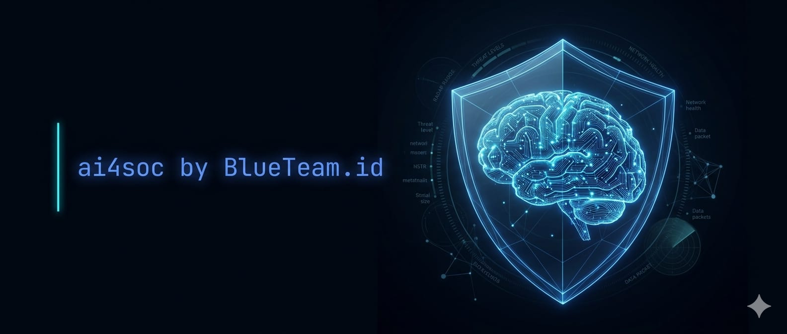

# ai4soc — AI-Augmented Security Operations

> **Learn to use AI coding agents in your daily SOC workflow.**
> From alert triage to detection engineering, without leaving your terminal.

<div align="center">



[](LICENSE)
[]()
[](CONTRIBUTING.md)
[](https://blueteam.id)

**[Get Started](#-getting-started) · [Course Modules](#-course-modules) · [Lab Environment](#-lab-environment) · [Contributing](#-contributing) · [Community](#-community)**

</div>

---

## What Is This?

**ai4soc** is a free, open-source course that teaches security analysts how to use AI coding agents to work faster and more effectively inside a SOC.

This is not a theory course. You learn by doing real SOC work with realistic lab data: triaging alerts, writing detection rules, analyzing threat intelligence, responding to incidents, and automating repetitive tasks, all with an AI agent working alongside you.

Inspired by [ccforpms.com](https://ccforpms.com) — built for security analysts, by security practitioners.

---

## Who Is This For?

| Role | What You'll Get |
|------|----------------|
| **SOC Analyst (L1/L2)** | Triage alerts faster, reduce repetitive work, write better tickets |
| **Detection Engineer** | Generate Sigma rules, KQL/SPL queries, and test cases with AI assistance |
| **Threat Intel Analyst** | Parse CTI reports, extract IOCs, and map TTPs to ATT&CK automatically |
| **Incident Responder** | Build timelines, draft SIRs, and generate stakeholder comms in minutes |
| **Security-Curious Developer** | Contribute to blue team tooling without deep SOC background |
| **SOC Lead / Manager** | Upskill your team on AI tools in a safe, controlled lab environment |

**You don't need to be a developer.** If you can describe what you want in plain English, you can use an AI coding agent. This course starts from zero.

---

## ⚠️ Important Disclaimers

### Education Purpose Only

**Everything in this repository is strictly for educational and learning purposes.**

This lab simulates a real SOC environment as closely as possible, but it is **not** production-ready tooling. Using workflows, rules, scripts, or configurations from this course in a real production environment requires additional security review, tuning, and alignment with your organization's specific policies, compliance requirements, and risk appetite.

The authors and contributors of ai4soc take no responsibility for outcomes resulting from using this material outside of a learning context.

### Data Sanitization

**Always sanitize your data before using it with any AI platform, whether cloud or local.**

Before feeding real logs, alerts, or artifacts into any AI model, remove or anonymize: real IP addresses, hostnames, usernames, credentials, organization names, customer data, and any PII or regulated information.

> ✅ Lab data in the `lab/` directory is **fully synthetic** and safe to use as-is.
> 🚫 Real incident data should **never** be sent to a cloud AI service unredacted.

Full sanitization guidance → [`docs/sanitization-guide.md`](docs/sanitization-guide.md)

---

## 🤖 AI Model Support

ai4soc works with multiple AI platforms. Choose based on your access and budget.

> **⚠️ Model Reference Disclaimer:** The AI landscape evolves rapidly. The models listed below are reference points at the time of writing. Always check for the latest model releases as newer versions may offer better reasoning, lower resource consumption, improved token efficiency, and stronger performance on security tasks. Don't limit yourself to what's listed here.

| Tier | Platform | Cost | Privacy | Best For |
|------|----------|------|---------|----------|
| 🟢 **Tier 0** | [Ollama](https://ollama.com) + local model | Free | Air-gapped, fully local | Analysts with budget or access constraints |
| 🟡 **Tier 1** | [OpenRouter](https://openrouter.ai) | Pay-per-use | Cloud | Flexible access, no subscription needed |
| 🔵 **Tier 2** | [Claude Code](https://claude.ai/code) | Subscription | Cloud | Best experience, full agentic mode |

**This course was developed and fully tested using Claude Code (Tier 2).** All modules are verified to work with Claude Code. Tier 0 and Tier 1 support is provided on a best-effort basis. Community testing with other models is welcome and encouraged — see [Contributing](#-contributing).

**Reference local models for Tier 0** *(check for newer versions before installing):*

| Model | Strength | Min RAM |
|-------|----------|---------|
| `qwen2.5-coder:14b` | Code generation and analysis | 16 GB |
| `deepseek-r1:8b` | Reasoning and investigation | 8 GB |
| `llama3.2:3b` | Fast, lightweight, good for getting started | 4 GB |

Every module includes instructions for all three tiers. No vendor lock-in. No single platform required.

---

## 📚 Course Modules

> 🚧 **Phase 1 is under active development.** Modules 0 and 1 are available now. Watch this repo or subscribe to releases to be notified when new modules ship.

### Module 0: Getting Started
*Install your AI agent, clone the repo, run your first security task.*

| Lesson | Title |
|--------|-------|
| 0.0 | [Introduction & Philosophy](modules/0-getting-started/0.0-introduction.md) |
| 0.1 | [Install Your AI Agent](modules/0-getting-started/0.1-install.md) |
| 0.2 | [Clone the Repo & Explore the Lab](modules/0-getting-started/0.2-setup.md) |
| 0.3 | [Your First SOC Task in 5 Minutes](modules/0-getting-started/0.3-first-task.md) |

### Module 1: Fundamentals
*Understand how AI agents work and apply them to real SOC tasks.*

| Lesson | Title |
|--------|-------|
| 1.1 | [AI Agents vs. Chatbots — Why It Matters for SOC](modules/1-fundamentals/1.1-agents-vs-chatbots.md) |
| 1.2 | [File Operations — Read Logs, Write Reports, Edit Rules](modules/1-fundamentals/1.2-file-operations.md) |
| 1.3 | [First SOC Tasks — Triage, Enrich, Document](modules/1-fundamentals/1.3-first-soc-tasks.md) |
| 1.4 | [Parallel Agents — Triage 10 Alerts Simultaneously](modules/1-fundamentals/1.4-parallel-agents.md) |
| 1.5 | [Custom Roles — Analyst, Responder, Hunter, Engineer](modules/1-fundamentals/1.5-custom-roles.md) |
| 1.6 | [CLAUDE.md — Giving Your Agent Persistent SOC Context](modules/1-fundamentals/1.6-claude-md.md) |
| 1.7 | [Slash Commands & Navigation](modules/1-fundamentals/1.7-navigation.md) |

### Module 2: Core SOC Workflows *(coming in Phase 2)*

| Lesson | Title |
|--------|-------|
| 2.1 | Alert Triage at Scale |
| 2.2 | Detection Engineering with AI |
| 2.3 | CTI Analysis — From Report to ATT&CK |
| 2.4 | Incident Response — Timeline to SIR |

### Module 3: Automation & Integrations *(coming in Phase 3)*

| Lesson | Title |
|--------|-------|
| 3.1 | Python for SOC — Write Tools Without Deep Python Knowledge |
| 3.2 | Connect to Wazuh via MCP |
| 3.3 | API Integration — VirusTotal, AbuseIPDB, Shodan |
| 3.4 | Workflow Automation with AI Assistance |

### Module 4: Advanced & Capstone *(coming in Phase 4)*

| Lesson | Title |
|--------|-------|
| 4.1 | Threat Hunting — Hypothesis to Query |
| 4.2 | Purple Team — Simulation & Coverage Mapping |
| 4.3 | Executive Reporting |
| 4.4 | Capstone — Build Your Own MCP Connector |

---

## 🏛️ Lab Environment

The lab simulates **PT Nusantara Digital** — a fictional Indonesian fintech company with ~500 employees, operating under PCI-DSS and OJK compliance requirements.

All lab data is **fully synthetic**. It is designed to feel realistic while being completely safe to use with any AI platform.

```
lab/
├── alerts/       SIEM alert exports in JSON and CSV format
├── logs/         Raw logs: Windows Event, Linux syslog, CloudTrail
├── ioc/          IOC lists: IPs, hashes, domains, URLs
├── reports/      CTI reports, sanitized and analysis-ready
└── scenarios/    Named threat campaigns with full attack chains
```

### Lab Scenarios (Phase 1)

| Scenario | Threat Type | ATT&CK Tactics | Difficulty |
|----------|-------------|----------------|------------|
| `scenario-01-brute-force` | Credential Access | Initial Access, Credential Access | Beginner |
| `scenario-02-phishing-bec` | BEC / Phishing | Initial Access, Collection | Beginner |
| `scenario-03-lateral-movement` | Insider / APT | Lateral Movement, Discovery | Intermediate |

---

## 🚀 Getting Started

### Prerequisites

A computer running macOS, Windows, or Linux, basic familiarity with opening a terminal, and nothing else. No coding experience required.

### Quick Start

**Step 1 — Clone the repository**
```bash
git clone https://github.com/blueteamid/ai4soc.git
cd ai4soc
```

**Step 2 — Install an AI agent**

Choose your tier and follow the setup guide in `setup/`:

```bash
# Tier 0: Ollama (free, local, no account needed)
# Install Ollama first: https://ollama.com/download
ollama pull qwen2.5-coder:14b

# Tier 2: Claude Code (recommended)
npm install -g @anthropic-ai/claude-code
```

Full setup guides → [`setup/`](setup/)

**Step 3 — Start the course**

With Claude Code:
```bash
claude
/start
```

With Ollama: follow [`setup/ollama.md`](setup/ollama.md)

---

## 🔌 SIEM Integration

ai4soc uses **Wazuh** as its primary lab SIEM. Wazuh is free, open source, and has the strongest existing MCP integration for AI-powered security operations.

| Integration | Status | Guide |
|-------------|--------|-------|
| Wazuh (primary) | ✅ Supported | [`connectors/wazuh/`](connectors/wazuh/) |
| Elastic / OpenSearch | 🗓️ Planned | Community contribution welcome |
| Splunk | 🗓️ Planned | Community contribution welcome |
| Datadog SIEM | 🗓️ Planned | Community contribution welcome |
| Microsoft Sentinel | 🗓️ Planned | Community contribution welcome |

Module 0 through 2 work entirely without a SIEM connection. SIEM integration is introduced in Module 3.

---

## 🤝 Contributing

**ai4soc is built for the global security community — contributions are welcome from everyone.**

We especially need help with:

🔌 **SIEM connectors** — MCP integrations for Elastic, Splunk, Sentinel, QRadar, and others

🤖 **Model testing** — this course was developed and tested with Claude Code; we need community members to test and document compatibility with other models (open source via Ollama, cloud via OpenRouter or direct APIs) and report findings so we can improve cross-model support for everyone

🧪 **Lab scenarios** — new threat campaign simulations with realistic data

📝 **Module content** — additional workflows, use cases, and exercises

🐛 **Bug reports** — issues with instructions, broken commands, or unclear steps

Read the [Contributing Guide](CONTRIBUTING.md) before submitting a pull request.

### How to Contribute

| Contribution Type | Process |
|-------------------|---------|
| Fix typo or clarify docs | Open a PR directly |
| Report model compatibility (works / doesn't work) | Open an issue with model name, version, and findings |
| New lab scenario | Open an issue first to discuss scope |
| New SIEM connector | Open an issue first, use the connector template |
| New module | Open an issue first to align with the roadmap |

---

## 🗺️ Roadmap

| Phase | Content | Status |
|-------|---------|--------|
| **v0.1** | Module 0, Module 1, basic lab data, Ollama and Claude Code setup | 🔨 In Progress |
| **v0.2** | Module 2, Wazuh MCP integration, lab scenarios 01–03 | 🗓️ Planned |
| **v0.3** | Module 3, automation workflows, API integrations | 🗓️ Planned |
| **v1.0** | Module 4, capstone, community connectors, certificate | 🗓️ Planned |

Follow the [project board](https://github.com/blueteamid/ai4soc/projects) for detailed progress.

---

## 💬 Community

**BlueTeam.ID** — [blueteam.id](https://blueteam.id) — Indonesian cybersecurity community

**GitHub Discussions** — [github.com/blueteamid/ai4soc/discussions](https://github.com/blueteamid/ai4soc/discussions)

**Issues & Bug Reports** — [github.com/blueteamid/ai4soc/issues](https://github.com/blueteamid/ai4soc/issues)

Questions, ideas, or feedback? Open a Discussion — we read everything.

---

## 📄 License

This project is licensed under the **MIT License** — see [LICENSE](LICENSE) for details.

You are free to use, modify, and distribute this material, including for commercial training purposes, as long as you include the original attribution.

---

## 🙏 Acknowledgements

[ccforpms.com](https://ccforpms.com) by Carl Vellotti — the inspiration for this format

[Wazuh](https://wazuh.com) — open-source SIEM powering the lab

[gensecaihq/Wazuh-MCP-Server](https://github.com/gensecaihq/Wazuh-MCP-Server) — MCP integration foundation

[SigmaHQ](https://github.com/SigmaHQ/sigma) — detection rule standard

The global blue team community — for sharing knowledge openly

---

<div align="center">

**Built with ❤️ by [BlueTeam.ID](https://blueteam.id)**

*ai4soc is not affiliated with, endorsed by, or sponsored by Anthropic, Wazuh, CrowdStrike, or any other vendor mentioned in this repository. All trademarks belong to their respective owners.*

</div>